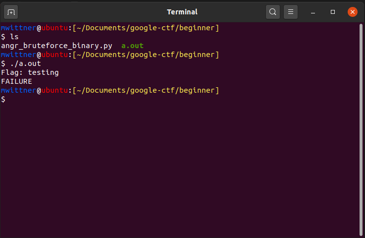
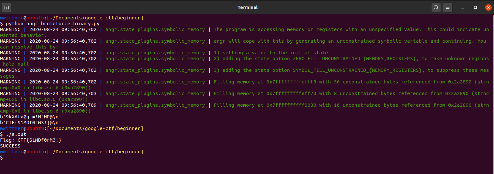

# Beginner

This is was a very simple reverse engineering challenge (the name of the challenge obviously gives it away that it should be easy). The objective of this challenge is to figure out the password, which is also the flag.

To start off, we are given a file a.out that is an executable. It asks for a flag from  STDIN, and returns FAILURE when typing the wrong flag (we will get to angr_bruteforce_binary.py later). 



With reverse engineering challenges, we like to disassemble it in Ghidra and then if necessary, run it through GDB. When throwing it in Ghidra, we noticed that symbols were still intact; thus, we could jump directly to main.


Almost immediately, we notice that there is a string compare looking for 16 characters: 
```C
iVar1 = strncmp(local_38,(char *)&local_28,0x10)
```

There is a tool that we developed called angr_bruteforce_binary.py that can crack this. It solves basic reverse engineering problems where we need to give input either through  STDIN or as a parameter. You can find it [on our GitHub tools repository](https://github.com/Ragnar-Security/ctf-tools/tree/master/Reverse%20Engineering/bruteforce_ascii). We specifically modified it for this binary: 

```py
#!/usr/bin/env python3
# Author: WittsEnd2
# Contributors: 

import angr
import claripy


def main():
    base_addr = 0x00100000 # define the offset 
    p = angr.Project("./a.out", main_opts={'base_addr':base_addr}) # set the binary we are working with and the offset
    arg_chars = [claripy.BVS('flag-{%d' % i, 8) for i in range(0x10)] # what to look for (and the length)
    arg = claripy.Concat(*arg_chars + [claripy.BVV(b'\n')]) 
    
    st = p.factory.entry_state(args=["./a.out"], add_options=angr.options.unicorn,  STDIN=arg) # What to actually run and ensure that we are working with  STDIN.
    for k in arg_chars:
        st.solver.add(k > 0x20)
        st.solver.add(k < 0x7f)

    sm = p.factory.simulation_manager(st)
    sm.run()
    for i in sm.deadended:

        print(i.solver.eval(arg, cast_to=bytes))

if __name__ == "__main__":
    main()
```
After running the script, we are able to retrieve the flag and confirm it is correct. 


